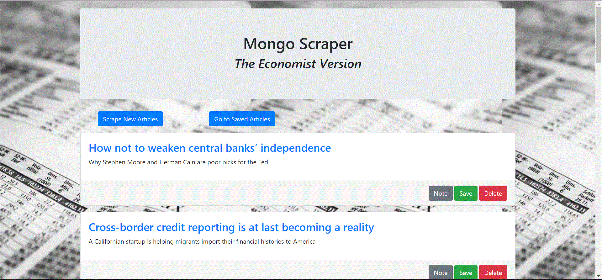
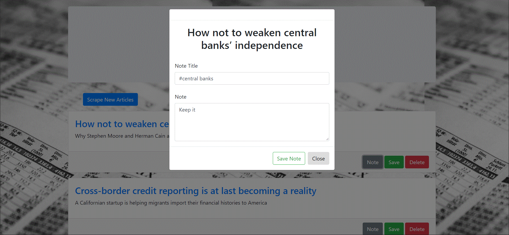

# Mongodb-Scraper
This web app lets users view and leave comments on the latest news articles that are scraped using Mongoose and Cheerio.
Cheerio allowed us to scrape The Economist website for article information such as title, summary, etc. Mongoose was utilized to manipulate and update data in the MongoDB database. 

## Future improvements
* Be able to scrape image of articles as well
* Improve UI on mobile even more
* Break down app into even smaller fragments and utilize ES6 syntax

## Demo
Link to deployed app (Heroku): [https://arcane-cliffs-97475.herokuapp.com/](https://arcane-cliffs-97475.herokuapp.com/)

## Screenshots 

---
Saving Note

